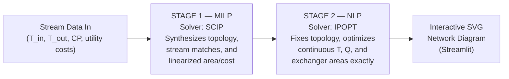

# HENS-Opt: Heat Exchanger Network Synthesis via Two-Stage MILP/NLP Optimization

**An open-source, Pyomo-based optimization engine that automatically synthesizes cost-optimal heat exchanger networks for industrial process plants — from raw stream data to a fully-dimensioned, publication-grade network diagram.**

[Pinch Analysis APP→](https://pinch-analysis-app.streamlit.app/)**[Formulations & Benchmarks Whitepaper →](FORMULATIONS_AND_BENCHMARKS.md)** &nbsp;|&nbsp; **[Architecture Evolution Log →](ARCHITECTURE_EVOLUTION.md)**

---

## What this solves

Heat integration is one of the highest-leverage decisions in process plant design — a well-synthesized heat exchanger network can cut utility (steam, cooling water) costs by 20–50% and directly determines CAPEX for the exchangers themselves. Doing this by hand (or with a spreadsheet Pinch analysis) gets you *targets*. It does not get you a *network*. This project automates the harder problem: given a set of hot/cold process streams, **find the actual topology, duties, and exchanger areas that hit those targets at minimum total annualized cost.**

## How it works

The core engine is a **two-stage mathematical programming pipeline**:



**Stage 1 (MILP)** decides *which streams exchange heat with which, and in what arrangement* — this is a combinatorial structural decision, so it needs a mixed-integer solver. Because exchanger cost is a nonlinear, non-convex function of duty and driving force, this stage uses **pre-solve dynamic tangent hyperplane linearization**: before the solver ever runs, an automated sampling engine evaluates the true nonlinear cost surface across a grid and generates supporting hyperplane cuts until the linearized model's error against the true surface drops below a target tolerance. This avoids the latency of classical iterative Outer Approximation while keeping the MILP tractable on open-source solvers.

**Stage 2 (NLP)** takes the fixed topology from Stage 1 and re-optimizes it exactly — no linearization — recovering the true optimal temperatures, duties, and areas for that structure.

Full mathematical detail, including the four linearization formulations currently under benchmark and why a purely convex-hyperplane approach breaks down (with Hessian-based proof), is in the [formulations whitepaper](FORMULATIONS_AND_BENCHMARKS.md).

## Results

| System Size | Status | Typical Solve Time |
|---|---|---|
| 2×2 streams | ✅ Runs correctly | Seconds |
| 4×5 streams | 🔧 Active development | Currently times out >1800s on some instances |

The 4×5 case is the current engineering frontier: open-source MILP solvers (SCIP) lack the industrial-grade 2D SOS2 branching that commercial solvers (Gurobi/CPLEX) ship with, so binary variable growth from higher-dimensional piecewise linearization becomes the bottleneck. Current work is on tighter variable bounding, stronger presolve cuts, and formulation selection — tracked live in the [benchmarks doc](FORMULATIONS_AND_BENCHMARKS.md).

## Ecosystem

This repo is the optimization core of a larger integrated PSE toolkit:

| Module | Status | Description |
|---|---|---|
| **Pinch Analysis** | 🟢 Complete, runs locally | Composite Curves, Grand Composite Curve, pinch temperature, minimum utility targets |
| **HENS-Opt** (this repo) | 🟡 Core, active R&D | Two-stage MILP/NLP network synthesis, SVG rendering |
| **STHEX Sizer** | 🟡 In development | Shell & tube thermal-hydraulic rating; closes the loop back into HENS-Opt via a damped-relaxation coefficient update (see below) |
| **Automated Report Generator** | 🟡 In development | Compiles all three into TEMA-compliant engineering reports and CAPEX/OPEX executive summaries |

**Damped feedback loop (HENS-Opt ↔ STHEX):** the network optimizer initially assumes approximate heat transfer coefficients (U). Once STHEX computes rigorous thermal-hydraulic ratings for the synthesized matches, the updated U-values are fed back with damping to prevent numerical oscillation:

$$U^{(k+1)} = (1 - \alpha)\, U^{(k)} + \alpha\, U_{\text{calculated}}^{(k)}$$

## Quickstart

This project requires two solver executables — **SCIP** (MILP) and **IPOPT** (NLP) — installed separately from the Python environment; Pyomo calls out to them as external binaries, they are not pip packages.

```bash
git clone https://github.com/RamiMakarem/heat-exchanger-network-synthesis.git
cd hens-opt
python -m venv venv && source venv/bin/activate
pip install -r requirements.txt
```

**1. Install SCIP:** download the SCIP Optimization Suite installer for your OS from [scipopt.org](https://www.scipopt.org/) and run it, or install via conda (`conda install -c conda-forge scip`). Confirm it's on your system PATH:
```bash
scip --version
```

**2. Install IPOPT:** download prebuilt binaries from the [IPOPT releases page](https://github.com/coin-or/Ipopt/releases), or install via conda (`conda install -c conda-forge ipopt`). Confirm it's on PATH:
```bash
ipopt --version
```

If either command isn't found, add the install directory to your PATH manually (Windows: System Properties → Environment Variables; macOS/Linux: append `export PATH=$PATH:/path/to/solver` to your shell profile).

**3. Run the app:**
```bash
streamlit run app.py
```

Load `examples/streams_2x2.csv` in the UI for a fast first run.

## Tech stack

`Python` · `Pyomo` · `SCIP` (MILP) · `IPOPT` (NLP) · `Streamlit` · `NumPy` / `Pandas` for stream data handling · SVG for network rendering

## Roadmap

- [ ] Close 4×5 performance gap via tighter presolve bounding
- [ ] Ship STHEX Sizer damped-loop integration
- [ ] Ship automated report generator (managerial + engineering PDF/HTML)
- [ ] Benchmark against Gurobi (academic license) to quantify the open-source solver gap directly

## About / Contact

Built solo over 9 months as a deep-dive into applying mathematical programming to process design — the kind of problem that sits at the intersection of chemical engineering, operations research, and software engineering. Open to opportunities in process systems engineering, optimization/OR, or applied ML-for-engineering roles.

**[Rami Makarem]**
