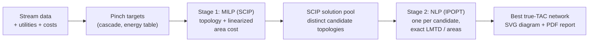

# HENS-Opt: Heat Exchanger Network Synthesis via MILP → NLP

An open-source, Pyomo-based tool that synthesizes minimum-Total-Annualized-Cost (TAC) heat exchanger networks from raw stream data: pinch targets, network topology, exact temperatures and areas, an SVG network diagram, and a PDF report, all through a Streamlit app.

**Docs:** [Formulations & Benchmarks](FORMULATIONS_AND_BENCHMARKS.md) · [Architecture Evolution](ARCHITECTURE_EVOLUTION.md)

---

## What it does

Pinch analysis gives energy *targets*. It does not give a *network*. Given hot and cold process streams and utility data, HENS-Opt finds the actual topology, duties, and exchanger areas that minimize TAC, co-optimizing match selection, stage sequencing, and utility placement in a Yee–Grossmann stage-wise superstructure.

## How it works


```mermaid
flowchart LR
    A["Stream data<br/>+ utilities + costs"] --> B["Pinch targets<br/>(cascade, energy table)"]
    B --> C["Stage 1: MILP (SCIP)<br/>topology + linearized<br/>area cost"]
    C --> D["SCIP solution pool<br/>distinct candidate topologies"]
    D --> E["Stage 2: NLP (IPOPT)<br/>one per candidate,<br/>exact LMTD / areas"]
    E --> F["Best true-TAC network<br/>SVG diagram + PDF report"]
```

**Stage 1, MILP.** Exchanger cost `b·A^β` with `A = Q/(U·LMTD)` is rewritten as `b · Q^β · (U·LMTD)^-β = b · G · H`, and each piece is linearized separately:
- `H = (U·LMTD)^-β` is bounded below by adaptively generated supporting hyperplanes (a convex surface), with error measured against the true function.
- `G = Q^β` uses a 1D SOS2 piecewise-linear interpolation (matches with β = 1 use `Q` directly).
- `P = G·H = A^β` is a McCormick relaxation of the bilinear product, scaled by the match binary so it vanishes when the match is unused. Cost is then linear in `P`.

Utility exchangers use a single 1D SOS2 mapping from duty to cost, and phase-change ("elbow") constraints keep combined utilities (for example, desuperheat plus condense) feasible against ΔTmin.

**Stage 2, NLP.** The MILP is a relaxation with linearization error, so its optimizer is not reliably the true-TAC-best topology. HENS-Opt collects a pool of distinct feasible topologies from SCIP and re-optimizes each in a fixed-topology NLP (temperatures, duties, areas, cost; warm-started from error-free values). It reports the candidate with the lowest true TAC.

Details, equations and known limitations are in [FORMULATIONS_AND_BENCHMARKS.md](FORMULATIONS_AND_BENCHMARKS.md).

## Benchmark: Linnhoff & Ahmad (1990) 9-stream problem (5 hot, 4 cold)

| Source | TAC | MILP Relaxation Gap | Solving time |
|---|---|---|---|---|---|
| Huber (doctoral thesis, Multi-objective heat exchanger network synthesis: simultaneous optimization of heat integration and procces design, TU wein, 2024) | 2.8526 × 10⁶ | 0% | 590s |
| Wu, Xu, Hu, Wang, Liang & Du (ACS Omega 2021, 6, 29459−29470) | 2.928 × 10⁶ | 0% | Not Specified |
| **HENS-Opt (this work)** | 2.711 × 10⁶ | MILP relaxation gap 7.6% (not converged) | 500s (limited by user) |

Notes for reading this table:
- **The MILP had not converged at the time limit.** The reported TAC is the NLP-refined value of the best topology found, not a proven optimum. Longer runs or a tighter formulation (see below) may improve it.
- Sources report gaps from different solvers and problem formulations, so gaps and runtimes are not directly comparable.
- The winning network was independently re-checked for energy balances, ΔTmin on every exchanger (exact LMTD), and TAC recomputed from final areas.

## Current status and known limitations

- **McCormick error.** The McCormick envelope on `P = G·H` is a relaxation, so the MILP's own linearized cost differs from the true cost of the network it selects. This produces a larger MILP-vs-true-TAC discrepancy, but the NLP stage removes it from the final reported network, and this formulation currently yields the best final networks.
- **Unconverged MILP.** Benchmark results are taken before the MILP converges. Tightening the formulation and running longer are both expected to improve them.
- **Not a global-optimality guarantee.** The MILP is a piecewise relaxation, the NLP is a local solver, and the stage count is fixed by the superstructure.
- **Open-source solver speed.** SCIP is slower on this MILP than commercial solvers, so larger networks can leave a sizable relaxation gap at the time limit.

## In development

- **2D DLOG formulation.** Replace the McCormick product and the 1D SOS2 on `G` with a single 2D disaggregated-logarithmic (DLOG) triangulated interpolation over `(G, H)`. This removes the McCormick relaxation error, so the MILP cost estimate becomes trustworthy.
- **SOS2 → DLOG everywhere, then HiGHS.** Converting the remaining SOS2 sets (including utility cost curves) to DLOG removes the dependence on native SOS2, which is the step needed to switch from SCIP to HiGHS. The solution-pool step currently relies on SCIP/PySCIPOpt and would need an equivalent.
- **MILP convergence.** Tighter bounding and presolve to close the gap within the time limit.
- **Shell-and-tube sizing (STHEX).** Thermal-hydraulic rating of synthesized matches (ΔP, velocity, geometry screening), feeding refined U values back into the network optimizer with damping. Not part of this repo yet.
- **Report generator.** Extending the PDF report with sizing results and executive cost summaries.

## Quickstart

HENS-Opt needs two solver executables, **SCIP** and **IPOPT**, which Pyomo calls as external binaries (they are not pip packages). Conda is the simplest way to get both:

```bash
git clone https://github.com/RamiMakarem/Hens-opt.git
cd Hens-opt
conda create -n hens python=3.11 -y && conda activate hens
conda install -c conda-forge scip ipopt -y
pip install -r requirements.txt

scip --version && ipopt --version     # both must be found on PATH
streamlit run App.py
```

Enter stream data and utility options in the UI. `ΔTmin`, MILP time limit, gap target, and solution-pool size are all set there.

Notes:
- File names are case-sensitive on Linux and macOS. Modules import each other as `Pre_process`, `Core`, `Solve_extract`, etc., so keep the file names exactly as in the repo.
- `pyscipopt` (in `requirements.txt`) enables the solution pool. Without it the app falls back to the single MILP incumbent.
- On Windows, if `ipopt` isn't found, add its `bin` folder to PATH or use the conda install above.

## Project layout

| File | Role |
|---|---|
| `App.py` | Streamlit UI: inputs, run, results, diagram, report download |
| `Pre_process.py` | Bounds, hyperplane envelope, G grids, model assembly |
| `Variables.py`, `Constraints.py`, `Objective.py` | MILP model blocks |
| `Solve_extract.py` | SCIP solve, solution-pool collection, result extraction and error diagnostics |
| `Build_active_topology.py` | Fixes topology and builds the warm start for the NLP |
| `Variables_NLP.py`, `Constraints_NLP.py`, `Objective_NLP.py` | Fixed-topology NLP model blocks |
| `Core.py` | Pinch cascade, NLP refinement (IPOPT), batch refinement of the solution pool |
| `H_HP_Tester.py` | Hyperplane envelope selection and error validation (used at runtime) |
| `Generate_hen_svg.py` | Network diagram renderer |
| `Report.py` | PDF report (reportlab + svglib) |

## Roadmap

- [ ] 2D DLOG formulation and SOS2 → DLOG conversion
- [ ] HiGHS backend
- [ ] Benchmark against Gurobi (academic license) to quantify the open-source solver gap
- [ ] Independent ΔTmin and energy-balance verifier for final networks
- [ ] Shell-and-tube sizing module and damped U-value feedback loop
- [ ] Further literature benchmarks

## About

Built solo as a deep-dive into applying mathematical programming to process design. Open to roles in process systems engineering, optimization/OR, and applied ML-for-engineering.

**Rami Makarem** · [GitHub](https://github.com/RamiMakarem)
